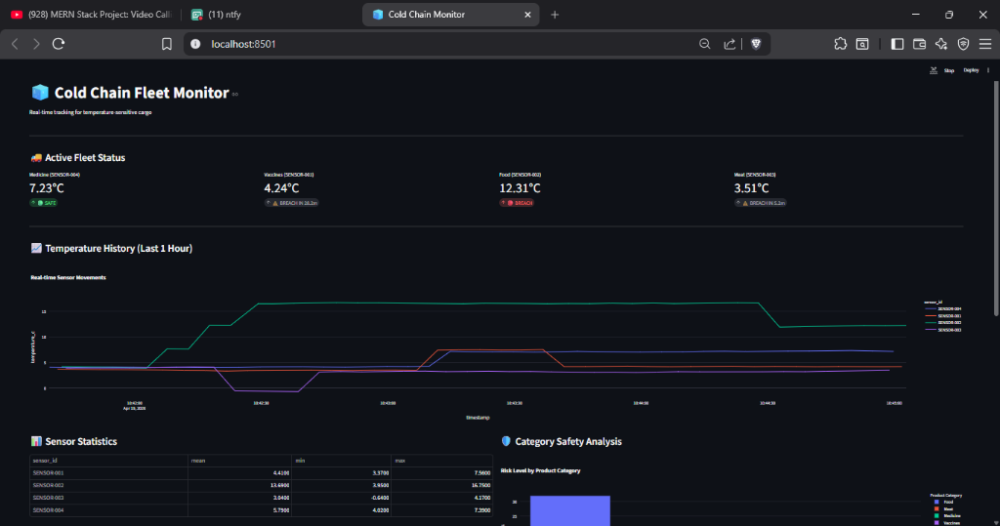
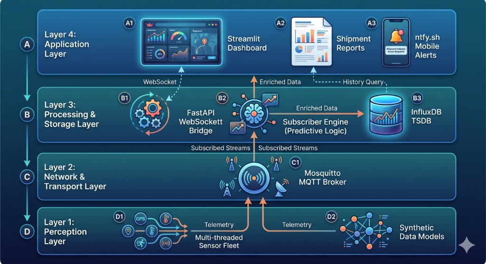
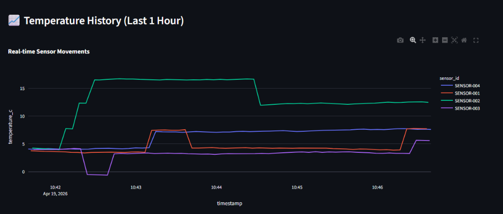
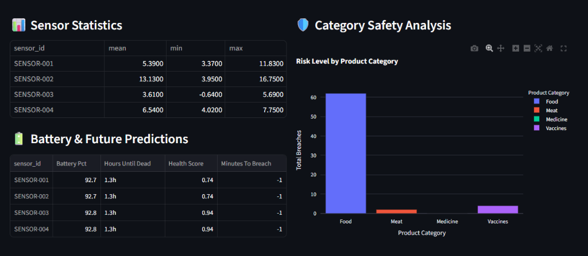

# 🧊 Cold Chain Monitoring System



A comprehensive real-time monitoring solution for temperature-sensitive cargo, featuring predictive analytics, automated alerting, and multi-sensor fleet tracking.

## 🚀 Overview

The **Cold Chain Monitoring System** is designed to ensure the integrity of temperature-sensitive goods (such as vaccines, pharmaceuticals, and perishable food) during transit. It utilizes a multi-layered architecture to collect, process, analyze, and visualize environmental data in real-time.

### Key Features
- **Real-time Monitoring**: Live tracking of temperature and humidity across multiple sensors.
- **Predictive Analytics**: Health scoring, battery life estimation, and "Time to Breach" predictions.
- **Automated Alerting**: Instant notifications via **ntfy.sh** when temperature thresholds are violated.
- **Historical Insights**: Detailed sensor statistics and safety analysis by product category.
- **WebSocket Integration**: Low-latency data broadcasting for smooth dashboard updates.

---

## 🏗️ Architecture

The system follows a 4-layer architecture for scalability and reliability:



1.  **Perception Layer**: Multi-threaded sensor simulators generating telemetry.
2.  **Network Layer**: MQTT Broker (Mosquitto) for reliable message transport.
3.  **Processing Layer**: FastAPI WebSocket bridge and Subscriber engine with predictive logic.
4.  **Application Layer**: Interactive Streamlit dashboard and mobile alerts.

---

## 💻 Tech Stack

- **Backend**: Python, FastAPI
- **Real-time Messaging**: MQTT (Mosquitto), WebSockets
- **Database**: InfluxDB (Time-series data storage)
- **Data Processing**: Pandas, NumPy
- **Frontend**: Streamlit, Plotly
- **Alerting**: Ntfy.sh

---

## 📊 Dashboard Highlights

### Real-time Sensor Movement
Visualize temperature trends over the last hour to identify potential risks before they become breaches.


### Predictive Metrics & Safety Analysis
Monitor battery health and future breach risks with advanced predictive models.


---

## 🛠️ Installation & Setup

### Prerequisites
- Python 3.9+
- [Mosquitto MQTT Broker](https://mosquitto.org/download/)
- [InfluxDB 2.x](https://portal.influxdata.com/downloads/)

### Environment Configuration
Create a `.env` file in the root directory:
```env
INFLUX_URL=http://localhost:8086
INFLUX_TOKEN=your_token
INFLUX_ORG=your_org
INFLUX_BUCKET=cold_chain
MQTT_BROKER=localhost
MQTT_PORT=1883
NTFY_TOPIC=your_topic
```

### Quick Start
The easiest way to start the system on Windows is using the provided batch script:
```powershell
.\run_all.bat
```

For manual execution and detailed instructions, see [RUN_INSTRUCTIONS.md](RUN_INSTRUCTIONS.md).

---

## 📂 Project Structure
- `api/`: FastAPI server for real-time WebSocket broadcasting.
- `subscriber/`: Core logic for data processing and database insertion.
- `simulator/`: Multi-sensor fleet simulation tools.
- `dashboard/`: Streamlit source code for the monitoring UI.
- `assets/`: Project images and documentation diagrams.

---

## 📜 Documentation
For a deep dive into the system logic and data science components, refer to:
- [PROJECT_DEEP_DIVE.md](PROJECT_DEEP_DIVE.md)
- [DATA_SCIENCE_&_ANALYTICS.md](DATA_SCIENCE_&_ANALYTICS.md)
- [DEVELOPMENT_LOG.md](DEVELOPMENT_LOG.md)
